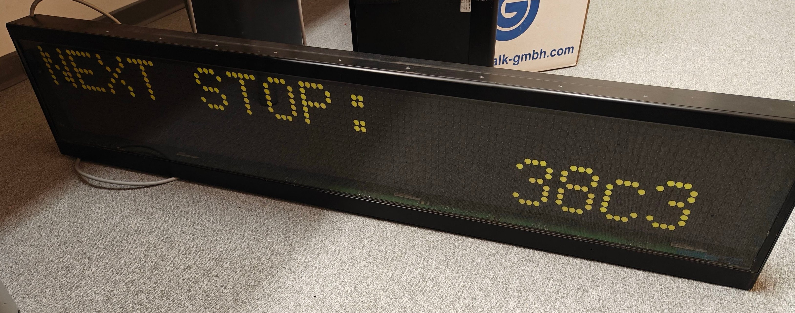
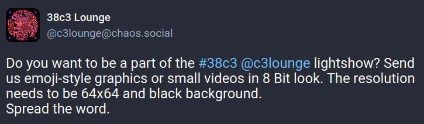
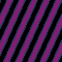
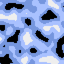
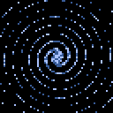

# Old-School demos mit pyxel!

- Kontakt: 
  - Mastodon: @pintman@chaos.social
  - Mail: pintman@0xabc.de

---

# Motivation

- Einfache Game-Engine lernen -> pyxel 
- Einfache Algorithmen für Old-School Demos

---

# Flipdotanzeige (Labor Assembly, Saal 3)

- Demos waren vorhanden.
- Ähnlichkeiten: Geringe Auflösung, wenige Farben



---

# Aufruf c3lounge

Ein sinnvoller Anlass:



https://chaos.social/@c3lounge/113698624147114424

---

# pyxel

- Einfache integrierte Python Game-Engine
  - https://github.com/kitao/pyxel
- inspiriert von PICO-8 (aber kostenlos)
- Editoren für
  - Sprites
  - Tilemaps
  - Sounds
  - Musik

---

# Sprite- und Tilemap-Editor

Sprite: Bei pyxel als Image bezeichnet
Tilemaps werden aus Sprites zusammengesetzt

 

---

# Sound- und Musik-Editor

 

---

# Einfaches Programm (Hello World)

```python
import pyxel

class App:
    def __init__(self):
        self.x = 0
        pyxel.init(64, 64)
        pyxel.run(self.update, self.draw)

    def update(self):
        self.x = (self.x + 1) % pyxel.width

    def draw(self):
        pyxel.cls(0)
        pyxel.rect(self.x, 0, 8, 8, 9)

App()
```

---

# Old-School Demo-Algorithmen (Auswahl)

Plasma  
Perlin Noise  
Moire 
Swirl 

---
# Moire

- Zwei Brennpunkte
- Distanz zwischen Pixel und Brennpunkten berechnen
- XOR der Distanzen bilden und durch Ringdicke teilen


---

# Moire (Code)

```python
    def draw(self):
        pyxel.cls(0)
        t = time.time()
        # moving center of two circles c1 and c2
        cx1 = math.sin(t / 2) * WIDTH / 3 + WIDTH / 2
        cy1 = math.sin(t / 4) * HEIGHT / 3 + HEIGHT / 2
        ...
        for y in range(HEIGHT): # calculate distance for y
            dy = (y - cy1) * (y - cy1)
            dy2 = (y - cy2) * (y - cy2)
            for x in range(WIDTH): # ... and x
                dx = (x - cx1) * (x - cx1)
                dx2 = (x - cx2) * (x - cx2)

                # distances
                rt1 = int(math.sqrt(dx + dy))
                rt2 = int(math.sqrt(dx2 + dy2))

                xored = rt1 ^ rt2  # xor the two distances
            
                shade = ((xored >> 4) & 1) # fancy division and mapping to 0,1
                pyxel.pset(x, y, shade * 3)
```
---

# Perlin Noise

- Durch Mouse-Bewegung beeinflussbar
- out of the box


---
# Perlin Noise (Code)

```python
class PerlinNoise:
    def __init__(self):
        self.mouse_parameter = 1

    def update(self):
        # get mouse x-position from pyxel
        self.mouse_parameter = max(0.1, 10 * pyxel.mouse_x / WIDTH)

    def draw(self):
        # clear and iterate each pixel x,y
        ...
        n = pyxel.noise(
            x / self.mouse_parameter,
            y / self.mouse_parameter,
            pyxel.frame_count / 40
        )

        # determine color based on noise value
        if n > 0.4: col = 7
        elif n > 0: col = 6
        elif n > -0.4: col = 12
        else: col = 0

        pyxel.pset(x, y, col)
```

---


# Ausblick

- weitere Effekte (Paletten, ...)
- Mode 7
- Tiles, Sound, Musik integrieren

---

# Web-App

Export als Executable oder Web-App möglich

```shell
$ pyxel papacke . demos.py
$ pyxel app2html pyxel_tutorial.pyxapp
```

---

## Quellen

- Meine Demos/Folien: https://github.com/tbs1-bo/pyxel_tutorial
- Demos als HTML-Export: https://tbs1-bo.github.io/pyxel_tutorial/38c3/demos.html
- Pyxel: https://github.com/kitao/pyxel
- Beschreibungen von Demo-Effekten: https://seancode.com/demofx

## Kontakt

- Mastodon: @pintman@chaos.social
- Mail: pintman@0xabc.de

---

# Weitere Demos


---
# "Plasma"


---

# "Plasma" (Code)

```python
class Plasma:
    def __init__(self):
        self.i = 0
        self.s = 1

    def update(self):
        self.i += 2
        self.s = math.sin(self.i / 100.0) * 2.0 + 6.0

    def draw(self):
        pyxel.cls(0) # clear screen
        for y in range(HEIGHT): # iterate all pixels x,y
            for x in range(WIDTH):
                if self.draw_px(x, y):
                    pyxel.pset(x, y, 6) # set pixel with pyxel

    def draw_px(self, x, y):
        # fancy trig-math
        v = 0.3 + (0.3 * math.sin((x * self.s) + self.i / 4.0) * 
                   math.cos((y * self.s) + self.i / 4.0))
        return v > 0.3
```

---
# Rotating Plasma


---

# Rotating Plasma (Code)

```python
class RotatingPlasma:
    def __init__(self):
        self.t = time.time()

    def update(self):
        self.t = time.time()

    def draw(self):
        # clear and iterate each pixel x,y
        ...
        v = math.sin(1 * (0.5 * x * math.sin(self.t/2) +
                          0.5 * y * math.cos(self.t/3)) + self.t)
        # -1 < sin() < +1
        # map the value range [0, 1]
        v = (v + 1.0) / 2.0
        if v > 0.3:
            pyxel.pset(x, y, int(b * 3))
```


---
# Swirl


---

# Swirl (Code)

```python
class Swirl:
    def __init__(self):
        self.timestep = 0
        self.parameter1 = 0
        
    def update(self):
        self.timestep = math.sin(time.time() / 18) * 1500
        self.parameter1 = pyxel.mouse_x / WIDTH

    def draw(self):
        # clear and iterate each pixel x,y
        ...
        if self.swirl(x, y, self.timestep) > 0.2:
            col = random.randint(5, 6)
            pyxel.pset(x, y, col)

    def swirl(self, x, y, step):
        x -= (WIDTH/2.0)
        y -= (HEIGHT/2.0)

        dist = math.sqrt(pow(x, 2) + pow(y, 2))
        angle = (step / 10.0) + dist / 1.5

        s = math.sin(angle)
        c = math.cos(angle)

        xs = x * c - y * s
        ys = x * s + y * c

        r = abs(xs + ys)
        val =  max(0.0, 0.7 - min(1.0, r/8.0))
        return val
```

